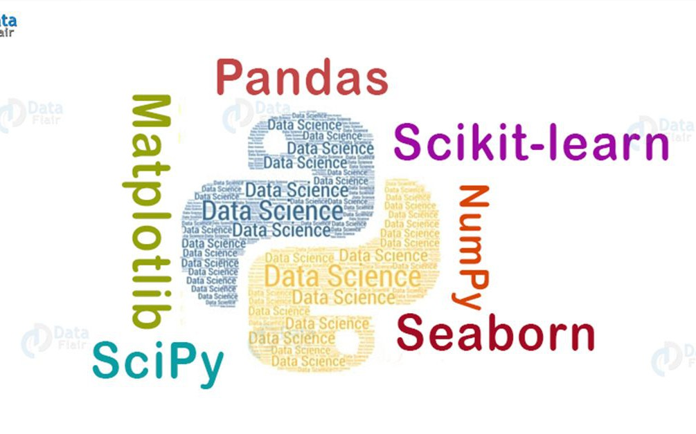

# Fundamentals of Data Analysis Project
Summary of the Tip's Dataset by Kevin Dooley

### Background & Objectives

For this project, I researched background information about the data set and completed a summary analysis on the dataset using statistical python packages and visualisation. The analysis was all documented in a jupyter notebook.

The aim of this project is to give an overview of the well-known Tips's Iris data set. The objectives of the project are as follows:
1. Use decriptive statistics and plots to describe the tips dataset
2. Discuss analyse whether there is a relationship between the total bill andn tip amount.
3. Analyse the relationship between variables within the dataset.

### Getting Started
1. If not already installed, download and install Python 3.
2. Recommend downloading python via Anaconda to get useful additional software including Jupyter and iPython. By downloading Anaconda you will get packages such as NumPy, Pandas, Matplotlib & Seaborn already built into Python. All of whihc are used in this notebook.
3. Download and install a command prompt - recommend Cmder (Windows) or Terminal (Mac).
4. To run the jupyter notebook on your computer you will need to download the tips_dataset.ipynb to your desktop using the clone tab on my Github repository.
5. Once downloaded to your desktop, open your command line
6. Using the 'cd' command on your command line, go to the folder you saved the .ipynb file to.
7. Type 'jupyter notebook' or 'jupyter lab' to open up jupyter and click on the .ipynb file to view the jupyter notebook.
8 You can also view the jupyter notebook directly on Github by clicking on the link to my repository https://github.com/kevindooley/fundamentals-data-analysis-project.

### Python Packages used in this Summary.

1. Pandas stands for “Python Data Analysis Library" and is open source, free to use. Pandas is quite a game changer when it comes to analyzing data with Python and it is one of the most preferred and widely used tools in data analysing if not the most used library. Pandas allows you to take data from a CSV and create a Python object with rows and columns called data frame. That data frame is then the basis for interpreting the data within the csv file.
2. NumPy is a package for Python for scientific computing. It supports large, multidimensional arrays and matrices, meaning it is essential for a dataset of this nature.
3. Seaborn is a high-level Python data visualisation library used for making attractive and informative statistical plots. It acts as a wrapper over matplotlib, and it’s used in conjunction with NumPy and pandas data structures
4. Matplotlib similar to seaborn is a toolkit used the visualisation of data. Matplotlib is a Python 2D plotting library which produces publication quality figures in a variety of hardcopy formats and interactive environments across platforms.

### Visualisation
Interactive visualisation, you can take a concept a step further by using technology to drill down into charts and graphs for more detail
I used graphical techniques to further begin uncovering the structures of the dataset:
* Univariate plots to better understand each attribute. 
* Multivariate plots to better understand the relationships between attributes.

### Abstract
This dataset includes the recording of 244 tips and was apparently completed so the waiter could see which factors played the biggest role in shaping the amount of tips he/she was earning. It contains 7 different variables that have been examined both individually and against each other. Some of  the finding included: Males had bigger group sizes, higher bill totals and higher tips compared to females but females had a higher tip percentage for tip vs total bill. The weekend was the busiest time of the week and not always did table groups tip more than the expect 15% of the total bill.

### Table of Contents
1. Dataset Background
    1. Starting the Dataset
    2. Reading for tips.csv
    3. Overview of Dataset
    4. Glance at the Data
2. Statistical Summary
3. Examine Day Variable
4. Examine Smoker Variable
5. Examine Sex Variable
6. Examine Time Variable
7. Examine Size Variable
8. Regression
9. Concludion and Overall Summary
10. References

